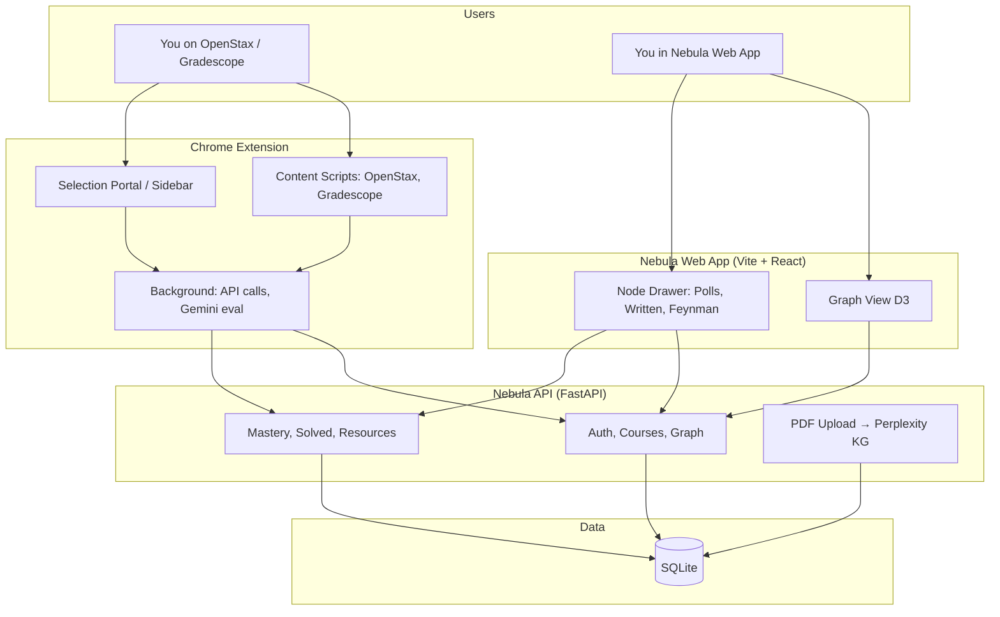
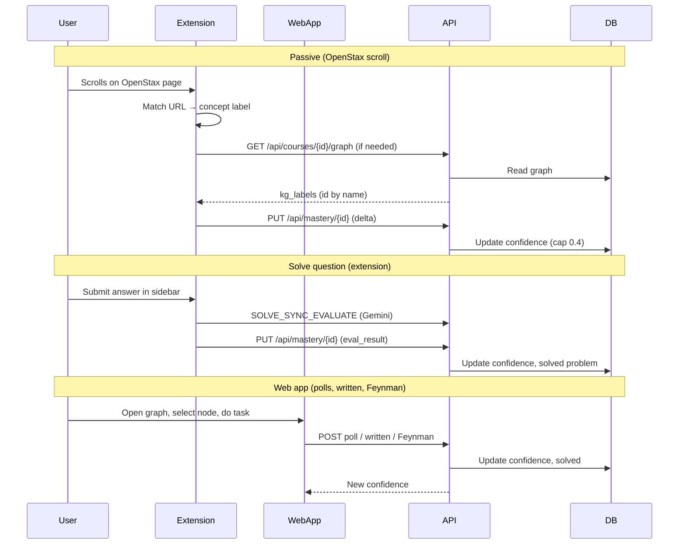
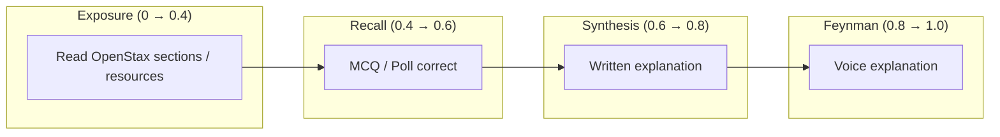

# Nebula — Knowledge Graph Mastery

**Passively track your study session to automatically build a live knowledge graph.** As you study, it silently extracts concepts and updates your mastery in real-time so you know what to review next.

---

## What It's For

- **Knowledge graph from your content** — Create a course, upload a PDF or use a premade graph; the backend extracts concepts and relationships (via Perplexity) and stores them.
- **Passive + active mastery** — While you browse OpenStax, scrolling and reading sections increases “exposure” mastery. In the extension you can solve practice questions (Gradescope-style) and get AI-evaluated; results sync back to the graph.
- **Four-tier progression** — Each concept moves through: **Exposure** (reading) → **Recall** (MCQ) → **Synthesis** (written explanation) → **Feynman** (voice explain). The web app shows the graph with color-coded confidence and lets you do polls, written questions, and Feynman (mic + Spline robot).
- **Chrome extension** — Classifies the current page to a concept (by URL or AI), tracks scroll-based exposure, and lets you submit and evaluate practice answers; mastery updates sync to the same backend the web app uses.

---

## Technologies

| Layer | Technologies |
|-------|--------------|
| **Backend** | Python 3.10+, [FastAPI](https://fastapi.tiangolo.com/), [Uvicorn](https://www.uvicorn.org/), [SQLAlchemy](https://www.sqlalchemy.org/) (SQLite), [PyPDF2](https://pypdf2.readthedocs.io/), [python-dotenv](https://github.com/theskumar/python-dotenv), [Pydantic](https://docs.pydantic.io/) |
| **Web app** | [React](https://react.dev/) 18, [TypeScript](https://www.typescriptlang.org/), [Vite](https://vitejs.dev/) 6, [Tailwind CSS](https://tailwindcss.com/) 4, [shadcn/ui](https://ui.shadcn.com/) (Radix), [Zustand](https://zustand-demo.pmnd.rs/), [D3.js](https://d3js.org/) (force graph), [Motion](https://motion.dev/) (animation), [Lucide React](https://lucide.dev/), [React Router](https://reactrouter.com/), [Three.js](https://threejs.org/) + [React Three Fiber](https://docs.pmnd.rs/react-three-fiber) + [Spline](https://splinetool.com/) (3D Feynman robot), [canvas-confetti](https://www.npmjs.com/package/canvas-confetti), [tsparticles](https://particles.js.org/) |
| **Chrome extension** | Vanilla JavaScript, [Chrome Extensions API](https://developer.chrome.com/docs/extensions/) (Manifest V3, service worker, content scripts, storage), [Web Speech API](https://developer.mozilla.org/en-US/docs/Web/API/Web_Speech_API) (optional) |
| **APIs & services** | [Perplexity API](https://docs.perplexity.ai/) (sonar-pro, PDF → knowledge graph extraction), [Google Gemini API](https://ai.google.dev/) (extension: solve-question evaluation) |
| **Data** | SQLite (`nebula.db`) |

---

## Architecture Overview



---

## Data Flow



---

## Mastery Tiers



- **Exposure**: Passive reading (scroll on OpenStax) or clicking resources; confidence capped at 0.4.
- **Recall**: Multiple-choice / poll in web app or extension; correct/partial/wrong updates confidence.
- **Synthesis**: Written question in Node Drawer; submit answer → backend records and can bump to 0.8.
- **Feynman**: Voice explanation in Node Drawer (mic + Spline); submit transcript → backend records and can set to 1.0 (mastered).

---

## Setup

### Prerequisites

- **Node.js** (v18+) and **npm**
- **Python** 3.10+
- **Chrome** (or Chromium) for the extension
- **Perplexity API key** ([perplexity.ai](https://www.perplexity.ai)) for PDF → knowledge graph extraction

### 1. Backend API

```bash
cd nebula-graphs/api
python -m venv venv
source venv/bin/activate   # Windows: venv\Scripts\activate
pip install -r requirements.txt
```

Create `nebula-graphs/api/.env`:

```env
PERPLEXITY_API_KEY=your_perplexity_api_key
```

Run the API (from `nebula-graphs/api`):

```bash
uvicorn main:app --reload --host 0.0.0.0 --port 8000
```

- API: **http://localhost:8000**
- SQLite DB: `nebula.db` in `nebula-graphs/api/`

### 2. Web App (Nebula frontend)

```bash
cd nebula-graphs
cp .env.example .env
# Edit .env if needed: VITE_API_URL=http://localhost:8000
npm install
npm run dev
```

- App: **http://localhost:5173**
- Register/login, create a course, upload a PDF or use a seeded graph, then open the graph and use the node drawer for polls, written, and Feynman.

### 3. Chrome Extension

1. Open **Chrome** → `chrome://extensions`
2. Turn on **Developer mode**
3. Click **Load unpacked**
4. Select the **`extension`** folder (inside this repo)
5. Extension icon appears; use **Options** (right‑click icon → Options) to:
   - **Log in** with the same email/password as the web app (backend at `http://localhost:8000`)
   - **Select a course** and click **Refresh knowledge graph**
   - (Optional) Set **Gemini API key** for “Solve Question” evaluation in the sidebar

The extension talks to `http://localhost:8000` by default (see `extension/background.js` → `API_BASE`). For OpenStax/Gradescope, enable the sidebar and use “Solve Question” / study mode as needed.

---

## Quick Start (full stack)

```bash
# Terminal 1 — API
cd nebula-graphs/api && source venv/bin/activate && uvicorn main:app --reload --port 8000

# Terminal 2 — Web app
cd nebula-graphs && npm run dev

# Then: load the extension from the extension/ folder, open Options, log in, pick course, refresh KG.
```

---

## Project layout

```text
IrvineHacks2026/
├── README.md                 # This file
├── extension/                # Chrome extension (Nebula)
│   ├── manifest.json
│   ├── background.js         # API, mastery, Gemini eval
│   ├── content.js            # OpenStax/Gradescope scroll & payload
│   ├── selection-portal.js   # Sidebar, classify, solve flow
│   ├── options.html / options.js
│   └── popup.html / popup.js
└── nebula-graphs/
    ├── api/                  # FastAPI backend
    │   ├── main.py
    │   ├── models.py
    │   ├── auth.py
    │   ├── requirements.txt
    │   └── .env              # PERPLEXITY_API_KEY
    ├── data/
    │   └── graph.json        # Optional premade graph
    ├── src/                  # React + Vite app
    │   ├── components/       # Graph, NodeDrawer, etc.
    │   ├── store/
    │   └── pages/
    ├── .env                  # VITE_API_URL
    └── package.json
```

---

## License

Part of Irvine Hacks 2026.
